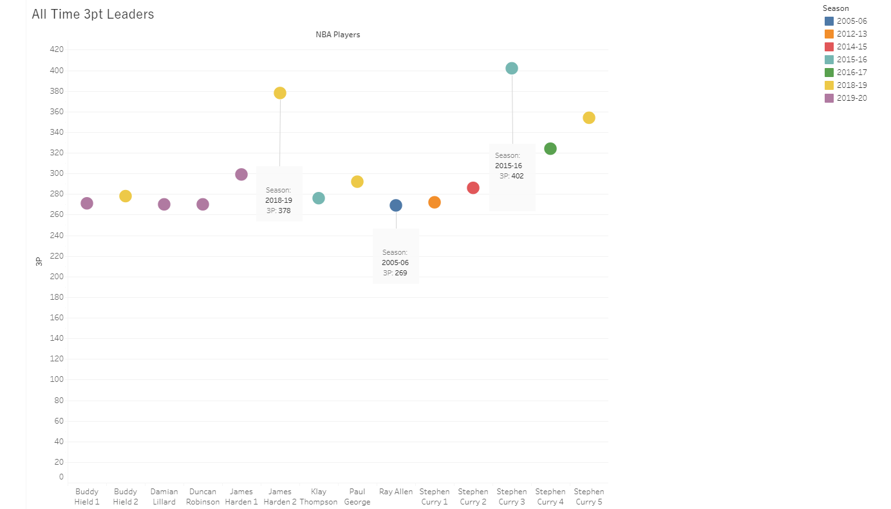
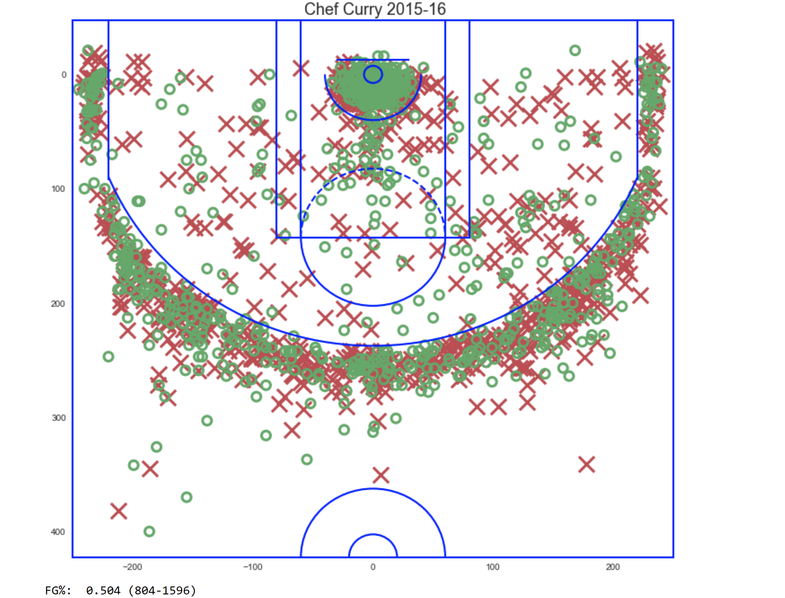
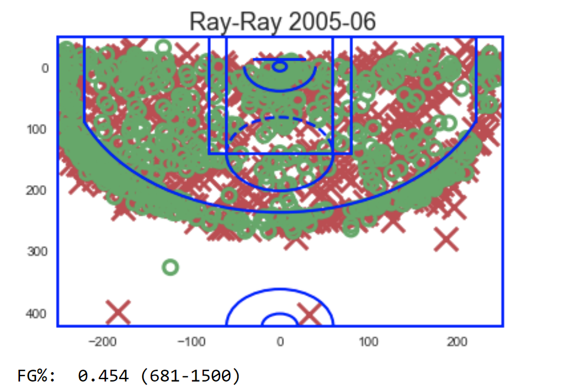
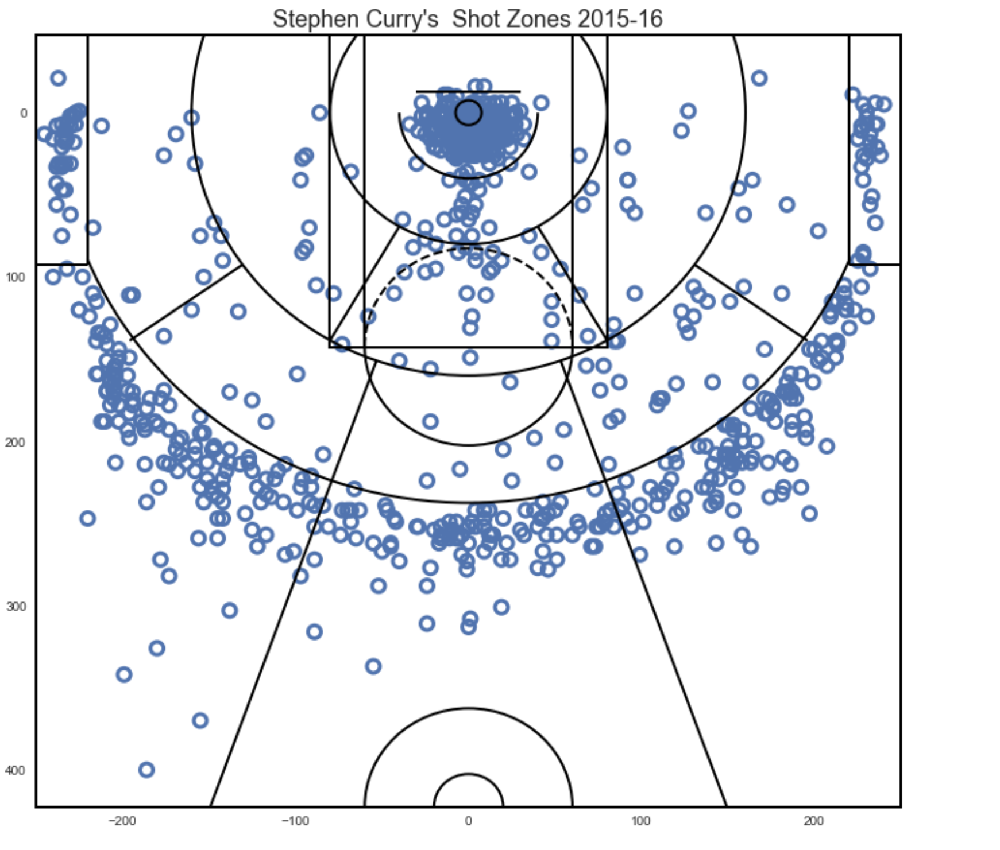
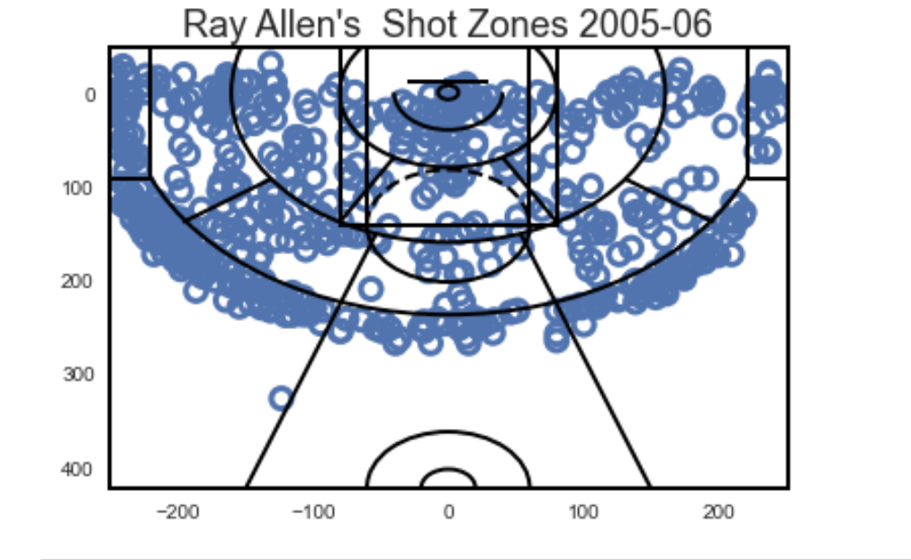
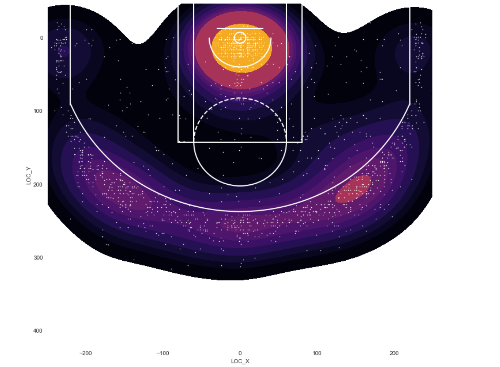
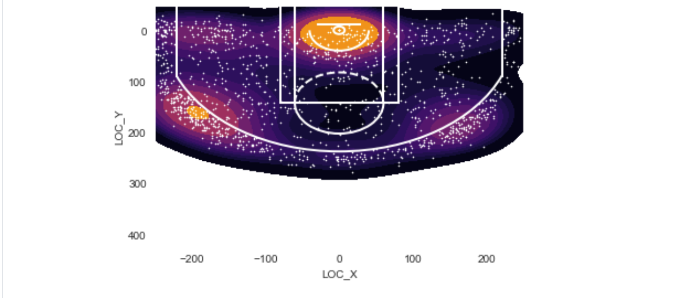

# Chef Curry's Shot Chart

---


---

## Background

My last project we went on a journey in discovering the pure dominance of LeBron James, but we’re going to switch gears and analyze the anomaly that is Stephen Curry.  Curry’s basketball career has been nothing but sensational to watch. He’s proven himself to NBA fans numerous of times his impact on the game. With 7 All Star appearances, 3 NBA Championships, 2 MVP titles, 1 scoring title, and he also holds the record for most 3pts made in one season, with 402. 

402 is the number I want us to focus on; using nba_api, phyton, matplotlib library, seaborn library, and tableau, I’ll show a different perspective on why that number is out of this world. 

---

#### Leaders

 Checkout my out my tableau link->[tableau_public](https://public.tableau.com/profile/nicholas.olumese#!/vizhome/AllTime3ptLeadersNBA/Sheet1?publish=yes)


Using Tableau, I was able create a scatter plot that showed the top 14 all-time 3pt leaders in a single season.  In the years leading up to Ray Allen’s record breaking 05-06 NBA season, Allen (ranked 14th) at that time was a great 3pt shooter (right next to Reggie Miller) that we’ve ever seen, with 269 threes made. That record would stand the test of time until Stephen Curry (ranked 1st, 3rd, 4th, 7th & 10th) stepped onto the court in the 12-13 season. It only took six years to break Allen’s record; Curry ended the season with 272 threes made. After the 13-14 season Curry followed his 12-13 performance with another record-breaking 14-15 season with 286 threes made, this was two years after his first attempt. Klay Thompson (ranked 9th) tried to keep pace with 276 threes made but Curry in his yet again record breaking 15-16 season ended with 402 threes made, which is absolutely insane.


Players like James Harden (ranked 2nd & 5th), Paul George (ranked 6th), Damian Lillard (ranked 12th), Buddy Hield (ranked 8th, 11th) needed to step there game up to even compete, and this was in the 19-20 season, so that meant Curry reigned supreme for 5 consecutive years as 3pt King. Harden is the only player to have had a breakout season in 18-19 with 378 threes made. If you look a little closer you see that Curry’s 14-15 performance was better then some players on the list competing the 19-20 season.  


---

#### NBA Shot Chart

Now that you have some understandig why Stephen Curry is called "the baby face asassin", let's look at where exactly Curry likes to shoot compared to Ray Allen’s shot choice since the torch was passed down between those two. 


 [Link to Curry Shot Chart Code ](Curry_shot_chart.ipynb)
 
 [Link to Allen Shot Chart Code](Allen_shot_chart.ipynb)
 
 
  

   

---

#### NBA Shot Zones

 [Link to Curry Shot Chart Code ](Curry_shot_chart.ipynb)
 
 [Link to Allen Shot Chart Code](Allen_shot_chart.ipynb)

  

---

#### NBA Heat Map

 [Link to Curry Shot Chart Code ](Curry_shot_chart.ipynb)
 
 [Link to Allen Shot Chart Code](Allen_shot_chart.ipynb)


  


---


[nba_api](https://github.com/swar/nba_api) helps to collect data from NBA’s data warehouse. Then I used matplotlib library to create a basketball shot chart. For the heat map I used seaborn, it helped showing the shot chart in a different way.

```
# Data and NBA API
import pandas as pd
import numpy as np

from scipy.stats import norm, gaussian_kde, percentileofscore

pd.options.display.max_columns = None
from nba_api.stats.static import players
from nba_api.stats.endpoints import shotchartdetail
from nba_api.stats.endpoints import playercareerstats

# For Shot Chart
import matplotlib.pyplot as plt
import seaborn as sns

from matplotlib import cm
from matplotlib.patches import Circle, Rectangle, Arc, ConnectionPatch
from matplotlib.patches import Polygon
from matplotlib.collections import PatchCollection
from matplotlib.colors import LinearSegmentedColormap, ListedColormap, BoundaryNorm
from matplotlib.path import Path
from matplotlib.patches import PathPatch

sns.set_style('white')
sns.set_color_codes()
```

---

#### Conclusion

The graphs show a clear picture on the shot selections of both players. Interesting enough Ray Allen liked to shoot very close to the three point line, but Curry took his shooting range to another level which literally changed the game of basketball today. Before Curry NBA teams where averaging about 4 threes pregame, Curry averages 5.1 threes per game, by himself. After Curry, NBA teams are now averaging 8.5 threes per game, A drastic uptick on performance in the entire league.  03-04 season there where 368 30pt+ performances compared to the 19-20 season with 775 30pt+ performances. Over the last few years, the NBA has seen an explosion in scoring, from all time greats sleeping walking there way to 30pts, to average players putting up career numbers on a nightly basis. Other factors have contributed to the high scoring, but you would have missed the point if your first thought wasn’t Stephen Curry.

Until next time….

---


#### Acknowledgments

* https://github.com/savvastj for the draw_court function.
* https://github.com/swar for the nba_api.
* https://github.com/hkair was my inspiration learned alot from this page. 

---

### Created by

__Nicholas Olumese__, Profile: [LinkedIn](https://www.linkedin.com/in/nicholas-olumese/)

